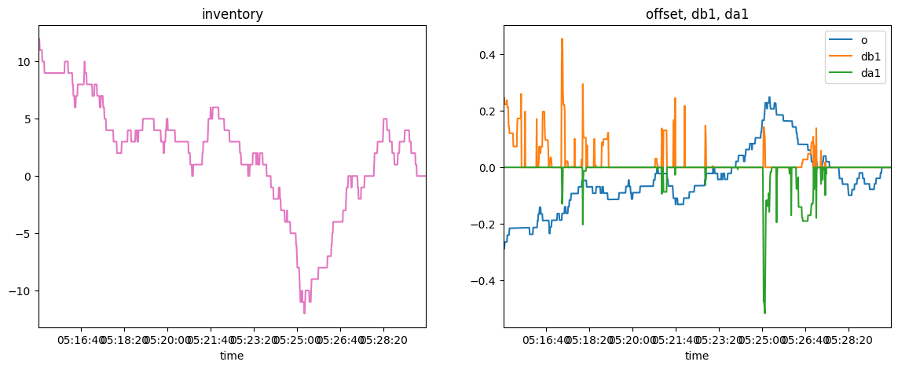
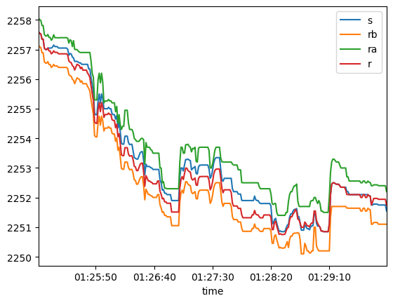

# High Frequency Trading in a Limit Order Book by Avellaneda & Stoikov 

Implements A&S 2006 market-making strategy based on inventory level on sample L2 orderbook data from LOBSTER. 

`data_cleaning.ipynb` contains the code where I explore the price levels/queue data for the first 5 bid/ask queues on either side of the book, and estimate $\lambda(\delta)$ and $A$ and $k$ - the parameters for Poisson arrival rates of market
 orders.

`main.ipynb` contains the simulation that implements the strategy on the data using the key equations and simulated fill rates for maker quotes.

The reservation price: 

$$r(s,t)=s-q\gamma\sigma^2(T-t)$$

Optimal quotes:

$$\delta^a +\delta^b = \gamma \sigma^2(T-t) + \frac{2}{\gamma}\ln(1+\frac{\gamma}{k})$$

Inventory, reservation offset from midprice, distance of quotes to best best and ask:
 

$A$ and $k$:

 

Quotes, midprice and reservation price:

 

